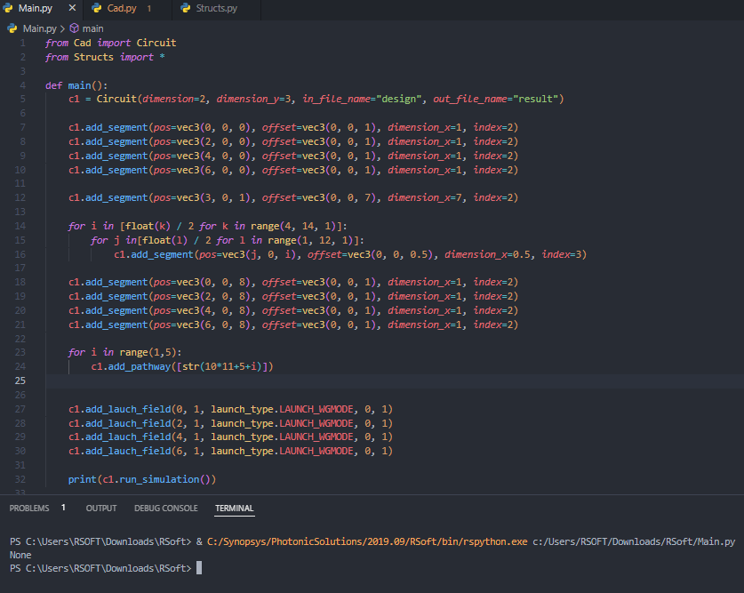
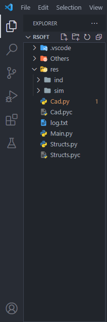
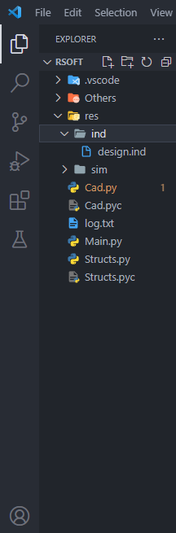
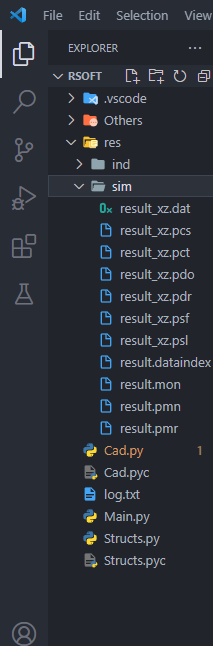

# How to use Cad.py

**Cad.py** is an interface used to programmatically create photonic circuits. It can be used to create any kind of segment, specifying its size, index, offset and width.

To use the interface you have to import various classes:

``` python
from Cad import Circuit
from Structs import *
```

- Circuit, which is the interface.
- The file `Structs.py` contains classes used to define some properties of the photonic circuit

## How to run the code

To run the code a specific Python interpreter must be used, which is contained in this directory: `C:/Synopsys/PhotonicSolutions/2019.09/RSoft/bin/rspython.exe`

## Methods 

### Constructor

``` python
    c1 = Circuit(dimension=d, dimension_y=n, in_file_name="index_file", out_file_name="out_file")
``` 

Where with the `dimension` you can specify if the design is 2D or 3D (2 or 3), `dimension_y` is the height of the segments, `in_file_name` is the name of the ".ind" file (RSoft format) without the file extension and the `out_file_name` is the name of the file with the simulation results.

### Add a segment

To add a segment to the circuit you can use the following method:

``` python
    c1.add_segment(pos=vec3(x, y, z), offset=vec3(x, y, z), dimension_x=n, index=i)
```
where `c1` is the circuit object previously created, `pos=vec3(x, y, z)` is the position of the segment, `offset=vec3(x, y, z)` is the offset of the segment, `dimension_x` is the width of the segment and the `index` is the refractive index of the segment.

### Add a pathway

``` python
    c1.add_pathway(segments)
```

Where `segments` is an array of strings with the segments you want in that pathway:

``` python
    c1.add_pathway(["1", "4", "8"])
```

#### Add a monitor to a pathway

To add a monitor to a pathway you first need to create a pathway, then you can create the monitor:

``` python
    c1.add_monitor(pathway, monitor_type.TYPE, tilt, monitor_component.COMPONENT)
```

Where `pathway` is the number of the pathway you want to add the monitor to, `monitor_type.TYPE` is the type of the monitor, `tilt` is the tilt of the monitor and `monitor_component.COMPONENT` is the component of the monitor (minor or major).
Example:

``` python
    c1.add_monitor(1, monitor_type.MONITOR_FILE_POWER
, "0", monitor_component.COMPONENT_MINOR)
```

>You can find all of the "`monitor_type`" and "`monitor_component`" [here.](#monitor-types-and-monitor-components)

## Add a Lauch Field

When you create a launch field you have to pay attention to some things:

- If you don't create a launch field by calling this function there the default one will stil be created, which has position (0, 0, 0) and a power of 1.
- When you create the first lauch field, you just change the value of the default one.

To create a launch field you can use the following method:

``` python
    c1.add_launch_field(x_position, power, launch_type.TYPE, launch_pathway, launch_tilt)
```

>You can find all of the `launch_type` [here.](#launch-types)

Example:

``` python
    c1.add_launch_field(0, 1, launch_type.LAUNCH_WGMODE, 0, 1)
```

## Run the Simulation

Once you have added all of the components to the circuit you can run the simulation with this method:

``` python
    c1.run_simulation()
```

This method will run the simulation, create the .ind file and all of the files that contain simulation results.

> **⚠️Attention!⚠️**: This method returns an array which contains the last value all the monitors recorded, which means that if you do not add a monitor it will return `None`.
> 

### Output file directory

The files will be created in a specific location. Once the simulation starts, in the folder where the .py file is, the *`/res`* directory will be generated. Inside of it you will find other two folders.



#### Index file

Inside the *`/res/ind`* folder there will be the .ind file. It is the file you can load on RSoft CAD as it contains the circuit's information.



#### Results files

Inside the *`/res/sim`* folder there will be all of the files genereted by running the simulation. The `.mon` file contains the data all the monitors captured.  If there are no monitors in the circuit that file will not be present.



## Special Parameters

### Monitor Types and Monitor Components

All the monitor types:

- MONITOR_FILE_POWER
- MONITOR_FILE_PHASE
- MONITOR_WGMODE_POWER
- MONITOR_WGMODE_PHASE
- MONITOR_GAUSS_POWER
- MONITOR_GAUSS_PHASE
- MONITOR_LAUNCH_POWER
- MONITOR_LAUNCH_PHASE
- MONITOR_WG_POWER
- MONITOR_TOTAL_POWER
- MONITOR_FIELD_NEFF
- MONITOR_FIELD_WIDTH
- MONITOR_FIELD_HEIGHT

All the monitor components:

- COMPONENT_MINOR
- COMPONENT_MAJOR

### Launch Types

All the launch types:

- LAUNCH_FILE
- LAUNCH_COMPMODE
- LAUNCH_WGMODE
- LAUNCH_GAUSSIAN
- LAUNCH_RECTANGLE
- LAUNCH_MULTIMODE
- LAUNCH_PLANEWAVE
  
### An example

``` python
from Cad import Circuit
from Structs import launch_field_all, vec3, vec2, monitor_type, monitor_component, launch_type

def main():
    c1 = Circuit(dimension=2, dimension_y=3, in_file_name="design", out_file_name="result")

    c1.add_segment(pos=vec3(0, 0, 0), offset=vec3(0, 0, 1), dimension_x=1, index=2)
    c1.add_segment(pos=vec3(2, 0, 0), offset=vec3(0, 0, 1), dimension_x=1, index=2)
    c1.add_segment(pos=vec3(4, 0, 0), offset=vec3(0, 0, 1), dimension_x=1, index=2)
    c1.add_segment(pos=vec3(6, 0, 0), offset=vec3(0, 0, 1), dimension_x=1, index=2)

    c1.add_segment(pos=vec3(3, 0, 1), offset=vec3(0, 0, 7), dimension_x=7, index=2)
    
    for i in [float(k) / 2 for k in range(4, 14, 1)]:
        for j in[float(l) / 2 for l in range(1, 12, 1)]:
            c1.add_segment(pos=vec3(j, 0, i), offset=vec3(0, 0, 0.5), dimension_x=0.5, index=3)

    c1.add_segment(pos=vec3(0, 0, 8), offset=vec3(0, 0, 1), dimension_x=1, index=2)
    c1.add_segment(pos=vec3(2, 0, 8), offset=vec3(0, 0, 1), dimension_x=1, index=2)
    c1.add_segment(pos=vec3(4, 0, 8), offset=vec3(0, 0, 1), dimension_x=1, index=2)
    c1.add_segment(pos=vec3(6, 0, 8), offset=vec3(0, 0, 1), dimension_x=1, index=2)

    for i in range(1,5):
        c1.add_pathway([str(10*11+5+i)])
    
    c1.add_monitor(1, monitor_type.MONITOR_WGMODE_POWER, "1", monitor_component.COMPONENT_MINOR)
    c1.add_monitor(2, monitor_type.MONITOR_WGMODE_POWER, "2", monitor_component.COMPONENT_MINOR)
    c1.add_monitor(3, monitor_type.MONITOR_WGMODE_POWER, "3", monitor_component.COMPONENT_MINOR)
    c1.add_monitor(4, monitor_type.MONITOR_WGMODE_POWER, "4", monitor_component.COMPONENT_MINOR)
    
    c1.add_lauch_field(launch_field_all(0, 1, launch_type.LAUNCH_WGMODE, 0, 1))
    c1.add_lauch_field(launch_field_all(2, 1, launch_type.LAUNCH_WGMODE, 0, 1))
    c1.add_lauch_field(launch_field_all(4, 1, launch_type.LAUNCH_WGMODE, 0, 1))
    c1.add_lauch_field(launch_field_all(6, 1, launch_type.LAUNCH_WGMODE, 0, 1))
    
    print(c1.run_simulation())

main()
```

#### Result

This is the result of the code above:


